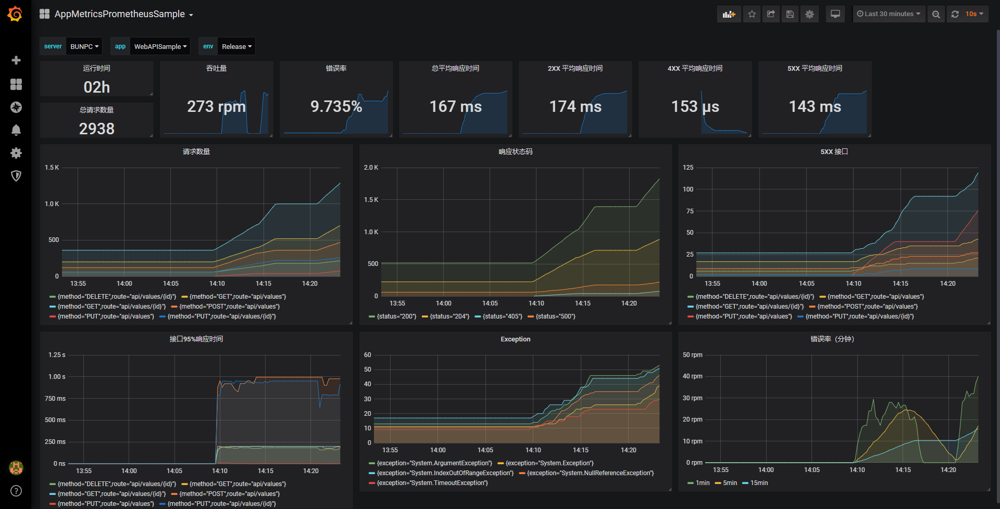

# App Metrics Prometheus Sample

- [AppMetrics](https://www.app-metrics.io/)
- [Prometheus](https://prometheus.io/)

在 .NET 程序中，通过 App Metrics 提供指标，再由 Prometheus 来抓取。




## .NET Framework Sample
`DotNetFrameworkSample.sln`
- [ASP.NET Web API](./src/DotNetFramework/WebAPISample/)
- [ASP.NET MVC](./src/DotNetFramework/MvcSample/)

## .NET Core
对于 ASP.NET Core ，App Metrics 提供了相关类库，参考 https://www.app-metrics.io/web-monitoring/aspnet-core/ 

## Metrics
| 指标名称 | 类型 | 含义 |
| ------- | ---- | ---- |
| api_boot_time_seconds | gauge | 程序启动时间 |
| api_response_time | summary | 接口响应耗时 |
| api_exception_count | counter | 接口抛出异常计数 |

注：MVC Sample 也有相关指标，将 `api_` 前缀替换为 `mvc_` 即可

### 通用标签
| 标签名称 | 含义 |
| ------- | ---- |
| app | 程序名称 |
| server | 服务器名称，用于在负载均衡环境下进行区分等 |
| env | 环境名称，用于区分开发环境、正式环境等 |
| my_custom_tag | 自定义标签示例，用于演示添加自定义标签 |

### api_boot_time_seconds
```
# HELP api_boot_time_seconds 
# TYPE api_boot_time_seconds gauge
api_boot_time_seconds{app="WebAPISample",server="BUNPC",env="Dev",my_custom_tag="MyCustonValue"} 1580913792
```

程序启动时间，类型为 gauge，但程序启动后该值就不会改变，值为 unix timestamp

### api_response_time
```
# HELP api_response_time 
# TYPE api_response_time summary
api_response_time_sum{method="GET",route="api/values/{id}",status="200",app="WebAPISample",server="BUNPC",env="Dev",my_custom_tag="MyCustonValue"} 0.912
api_response_time_count{method="GET",route="api/values/{id}",status="200",app="WebAPISample",server="BUNPC",env="Dev",my_custom_tag="MyCustonValue"} 7
api_response_time{method="GET",route="api/values/{id}",status="200",app="WebAPISample",server="BUNPC",env="Dev",my_custom_tag="MyCustonValue",quantile="0.5"} 0.098
api_response_time{method="GET",route="api/values/{id}",status="200",app="WebAPISample",server="BUNPC",env="Dev",my_custom_tag="MyCustonValue",quantile="0.75"} 0.122
api_response_time{method="GET",route="api/values/{id}",status="200",app="WebAPISample",server="BUNPC",env="Dev",my_custom_tag="MyCustonValue",quantile="0.95"} 0.282
api_response_time{method="GET",route="api/values/{id}",status="200",app="WebAPISample",server="BUNPC",env="Dev",my_custom_tag="MyCustonValue",quantile="0.99"} 0.282
```

接口响应耗时，类型为 summary，值的单位为秒，提供有如下几个额外的标签：

| 标签名称 | 含义 | 备注 |
| ------- | ---- | ---- |
| status | HTTP 响应状态码 |  |
| method | HTTP 请求方法 |  |
| route | 所请求的 API 路由 | API Only |
| controller | 处理请求的 Controller 名称 | MVC Only |
| action | 处理请求的 Action 名称 | MVC Only |

因为 `api_response_time` 是 summary，所以还带有如下指标：

| 指标名称 | 含义 |
| ------- | ---- |
| api_response_time_sum | 响应时间求和 |
| api_response_time_count | 记录的响应次数 |

可以根据 `api_response_time_count` 来计算吞吐量等。


### api_exception_count
```
# HELP api_exception_count 
# TYPE api_exception_count counter
api_exception_count{method="GET",route="api/values/{id}",exception="System.IndexOutOfRangeException",app="WebAPISample",server="BUNPC",env="Dev",my_custom_tag="MyCustonValue"} 1
```

接口抛出异常计数，类型为 counter，当接口抛出异常时会进行记录，提供如下几个额外的标签：

| 标签名称 | 含义 | 备注 |
| ------- | ---- | ---- |
| exception | 异常类型的完整名称 |  |
| method | HTTP 请求方法 |  |
| route | 抛出异常的 API 路由 | API Only |
| controller | 抛出异常的 Controller 名称 | MVC Only |
| action | 抛出异常的 Action 名称 | MVC Only |

### Grafana sample
以 API 的指标为例，参见 [dashboard.json](./grafana/dashboard.json)
