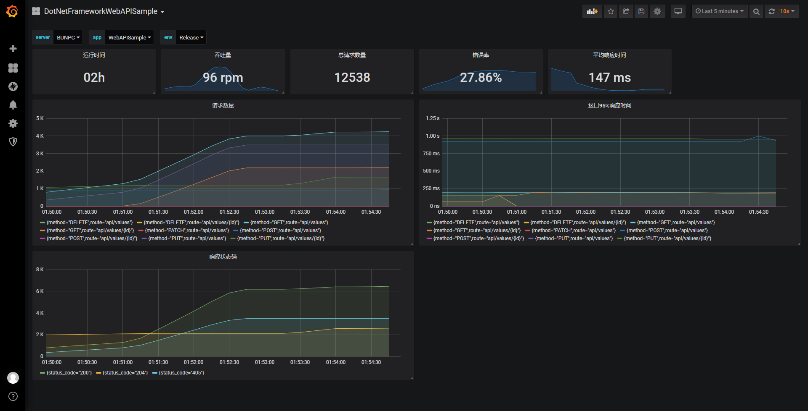

# ASP.NET Web API Sample

- .NET Framework 4.6.1
- [ASP.NET Web API 2](https://docs.microsoft.com/aspnet/web-api/)

## Install packages

```bash
Install-Package App.Metrics
Install-Package App.Metrics.Formatters.Prometheus
```

## Config App Metrics

如果项目中引入了依赖注入容器（例如 AutoFac），直接注册 `IMetricsRoot` ，并通过 `InitAppMetrics()` 的代码来配置 App Metrics 即可。如果没有依赖注入框架的话，可以新增一个类 `ApiMetrics` 用于初始化 App Metrics 的配置。

```csharp
public class ApiMetrics
{
    private static IMetricsRoot _metrics;

    public static IMetricsRoot GetMetrics()
    {
        if (_metrics == null)
        {
            _metrics = InitAppMetrics();
        }

        return _metrics;
    }

    private static IMetricsRoot InitAppMetrics()
    {
        var metrics = new MetricsBuilder()
                        .Configuration.Configure(options =>
                        {
                            options.DefaultContextLabel = "API";
                            options.AddAppTag(Assembly.GetExecutingAssembly().GetName().Name);
                            options.AddServerTag(Environment.MachineName);

#if DEBUG
                            options.AddEnvTag("Dev");
#else
                            options.AddEnvTag("Release");
#endif

                            options.GlobalTags.Add("MyCustomTag", "MyCustonValue");
                        })
                        .Build();

        return metrics;
    }
}
```

1. `DefaultContextLabel` 的值会成为指标的前缀，这里设置成 `API`，则默认所有指标都为 `api.` 开头
1. `AddAppTag()` 会为所有指标添加一个名为 `app` 的 tag，内容为当前程序的名称
1. `AddServerTag()` 会为所有指标添加一个名为 `server` 的 tag，内容是运行程序的机器名称
1. `AddEnvTag()` 会为所有指标添加一个名为 `env` 的 tag，用于区分运行程序的环境
1. 也可以通过 `GlobalTags` 属性，来添加自定义的 tag

如果没有依赖注入容器，还需要在 `Global.asax` 的 `Application_Start()` 中手动调用一下 `GetMetrics()` 方法以完成初始化。

```csharp
protected void Application_Start()
{
    // 省略其他内容

    ApiMetrics.GetMetrics();
}
```

## Add first metrics

我们把程序启动的时间作为一项指标，这样可以统计程序已经运行了多长时间。在 `Application_Start()` 中，当一切准备就绪后通过 App Metrics 创建一个 Gauge：

```csharp
            var metrics = ApiMetrics.GetMetrics();

            var unixTimestamp = DateTimeOffset.UtcNow.ToUnixTimeSeconds();
            metrics.Measure.Gauge.SetValue(new GaugeOptions
            {
                Name = "Boot Time Seconds"
            }, unixTimestamp);

```

`Name` 我习惯按可读性高的方式来写，因为 App Metrics 的 Prometheus 格式化器会自动帮我们处理它。

## Add /metrics endpoint

创建一个 Web API 控制器 `MetricsController`，来为 Prometheus 访问的 `/metrics` 填充内容。

```csharp
    [RoutePrefix("metrics")]
    public class MetricsController : ApiController
    {
        [HttpGet]
        [Route("")]
        public async Task<HttpResponseMessage> GetMetricsAsync()
        {
            var formatter = new App.Metrics.Formatters.Prometheus.MetricsPrometheusTextOutputFormatter();
            var snapshot = ApiMetrics.GetMetrics().Snapshot.Get();

            using (var ms = new MemoryStream())
            {
                await formatter.WriteAsync(ms, snapshot);
                var result = Encoding.UTF8.GetString(ms.ToArray());

                var response = Request.CreateResponse(HttpStatusCode.OK);
                response.Content = new StringContent(result, Encoding.UTF8, formatter.MediaType.ContentType);

                return response;
            }
        }
    }
```

## Other implementations

常见的，想要记录每个接口的调用次数、响应时间，我们可以通过 [DelegatingHandler](https://docs.microsoft.com/aspnet/web-api/overview/advanced/http-message-handlers) 来实现，参见 [MetricsHandler.cs](./Handlers/MetricsHandler.cs)。

## Grafana sample


参见 [dashboard.json](./Grafana/dashboard.json)
